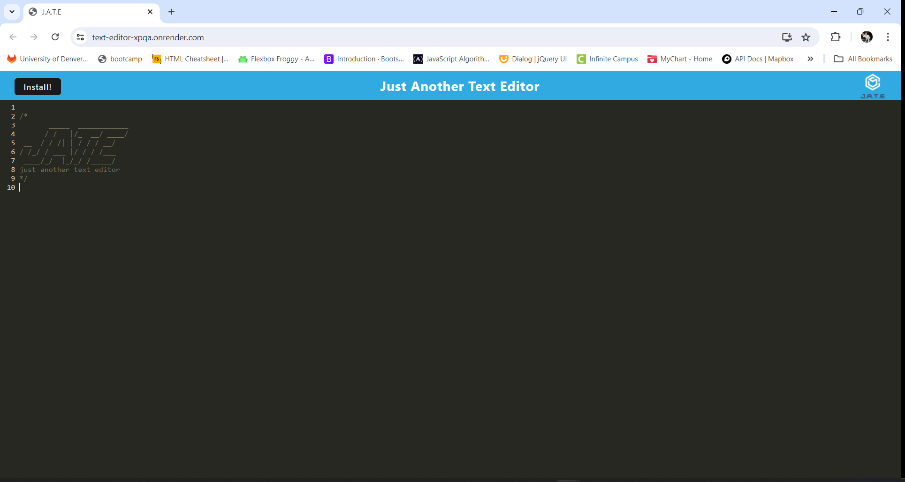
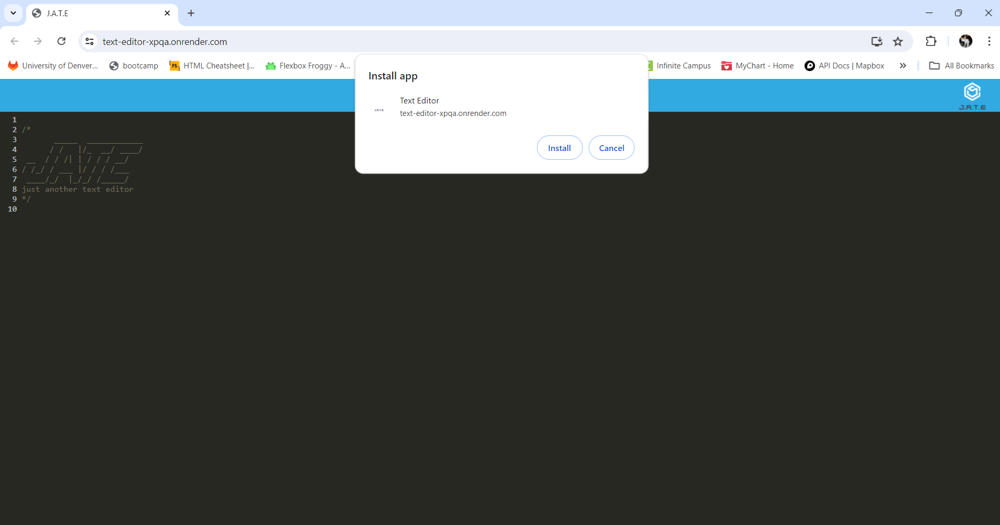
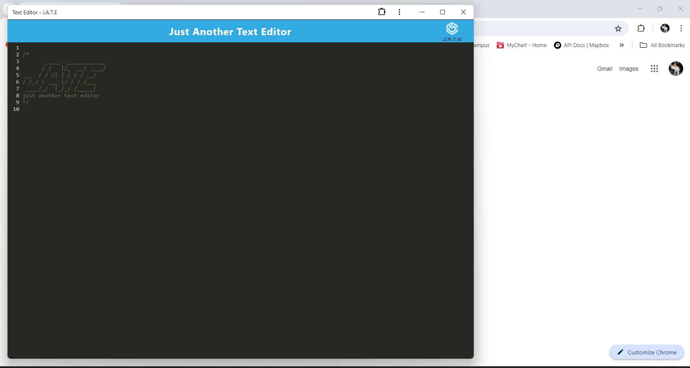
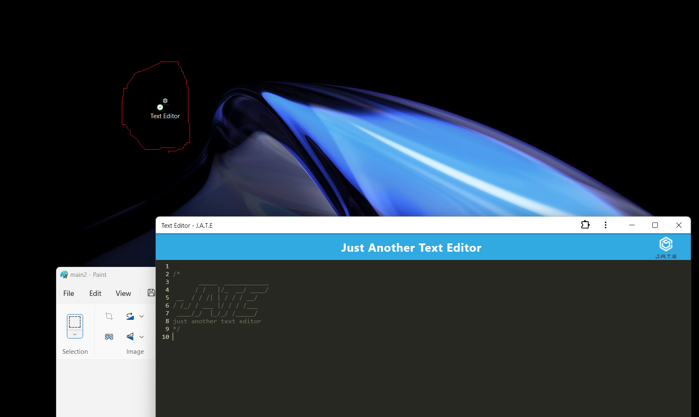

# Text Editor

## Description
- GIVEN a text editor web application
This is a feature-rich text editor application that provides offline capabilities and supports modern JavaScript features. The application is structured with a client-server architecture and utilizes IndexedDB for local storage, service workers for offline functionality, and Webpack for bundling JavaScript files.

- [Installation](#installation)
- [Usage](#usage)

## Installation
1 open terminal and type
```
npm install
```
```
npm start
```
2 open browser localhost:3000

## Usage
- go to https://text-editor-xpqa.onrender.com/
- type text 
- click install button to open the new window

 
 
 
 
    
## Features
- Client-Server Folder Structure: Organized architecture separating client and server code.
- Bundling with Webpack: JavaScript files are bundled using Webpack for optimized performance.
- HTML, Service Worker, and Manifest Generation: Webpack plugins generate necessary files for PWA capabilities.
- Modern JavaScript Support: Uses next-gen JavaScript features without errors in the browser.
- IndexedDB for Storage: Automatically creates a database storage for offline capabilities.
- Content Saving and Retrieval: Content is saved to IndexedDB on user interaction and retrieved upon reopening the application.
- App Installation: Can be installed as a desktop application via an Install button.
- Service Workers with Workbox: Registers service workers to handle caching and offline functionality.
- Pre-Caching of Assets: Static assets and pages are pre-cached for better performance.

## Link
- Render URL:https://text-editor-xpqa.onrender.com/
- Repository URL : https://github.com/namahage1/text-editor.git